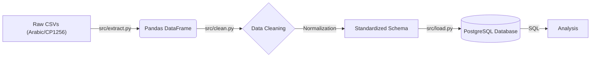

# Saudi Imports ETL Pipeline 🇸🇦

## 📌 Project Overview
A Data Engineering pipeline that automates the processing of Saudi Arabia imports data. It extracts quarterly datasets from the Saudi Open Data Portal, cleans the Arabic headers and encoding issues, and loads standardized data into a **PostgreSQL** data warehouse for analysis.

**Goal:** Transform raw, messy government CSV files into a structured SQL database for economic analysis.

## 🏗 Architecture
The project follows a modular **ETL (Extract, Transform, Load)** workflow:



## 🛠 Tech Stack
- **Python 3.10+** - Core Logic
- **Pandas** - Data Transformation
- **PostgreSQL** - Data Warehouse
- **SQLAlchemy & Psycopg2** - Database Connectors
- **Dotenv** - Security/Configuration

## 📂 Project Structure

```
saudi_imports_pipeline/
├── data/
│   ├── raw/                     # Source CSV files (Q1, Q2, Q3 2025)
├── src/
│   ├── extract.py              # Handles encoding detection (utf-8 vs cp1256)
│   ├── clean.py                # Renames Arabic columns to English 
│   ├── load.py                 # Loads dataframe into PostgreSQL
│   └── pipeline.py             # Main script with logging
├── sql/
│   ├── create_tables.sql       # Database schema
│   └── validation_queries.sql  # SQL checks
├── logs/                        # Pipeline execution logs
├── .env                         # Database credentials 
├── requirements.txt             # Python dependencies
└── README.md
```

## 📊 Database Schema
The pipeline creates a table `imports_staging` with the following structure:

| Column | Type | Description |
|--------|------|-------------|
| id | SERIAL | Primary Key |
| year | INT | Year (e.g., 2025) |
| quarter | VARCHAR | Q1, Q2, Q3, Q4 |
| country | VARCHAR | Country of origin |
| commodity_code | VARCHAR | HS Code |
| import_value | DECIMAL | Value in SAR |
| weight_kg | DECIMAL | Net weight |

